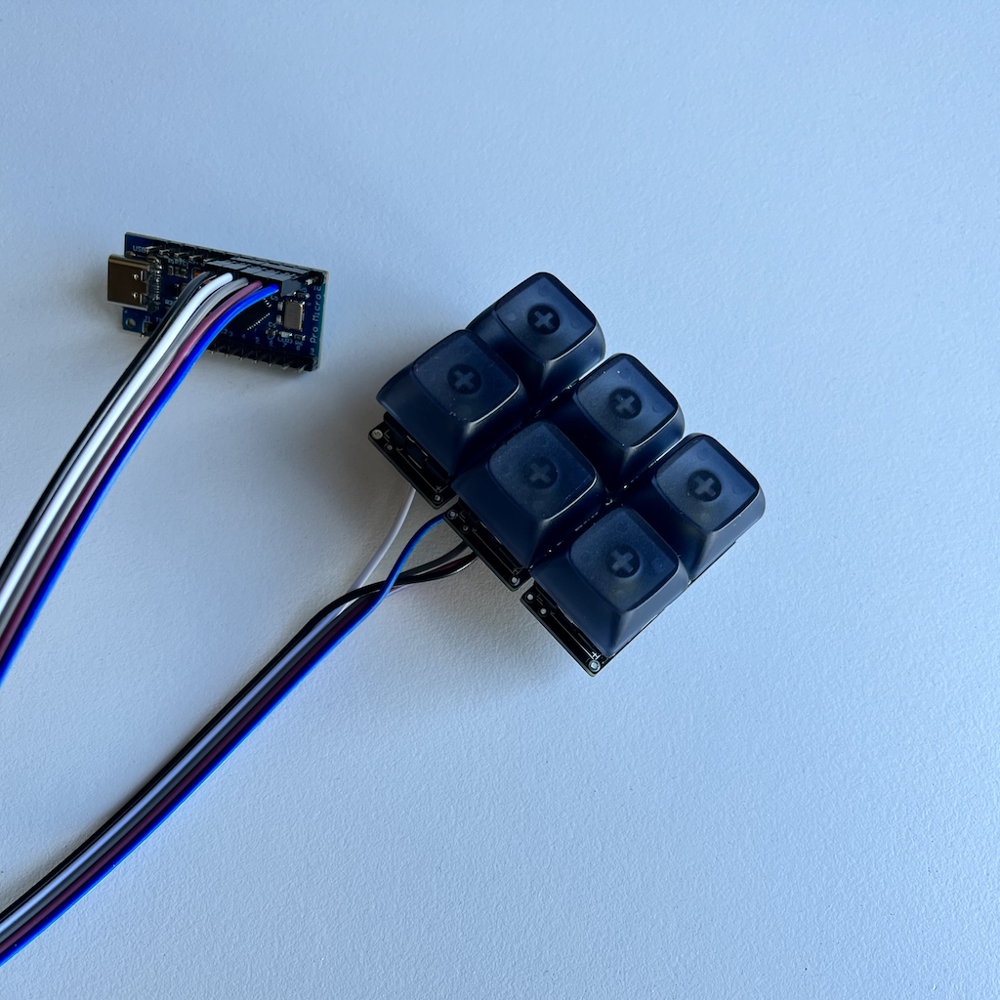

3x2 Macropad
---



[Let's RTFM here](https://get.vial.today/manual/first-use.html)

Then when we're all set, we can run:

```bash
┌─────────┬─────────┬─────────┐
│   K00   │   K01   │   K02   │
├─────────┼─────────┼─────────┤ Encoder
│   K03   │   K04   │   K05   │ ( K06 )
└─────────┴─────────┴─────────┘

$ make 3x2:via
```


Then sideload the firmware using [QMK Toolbox](https://github.com/qmk/qmk_toolbox). GLHF!
